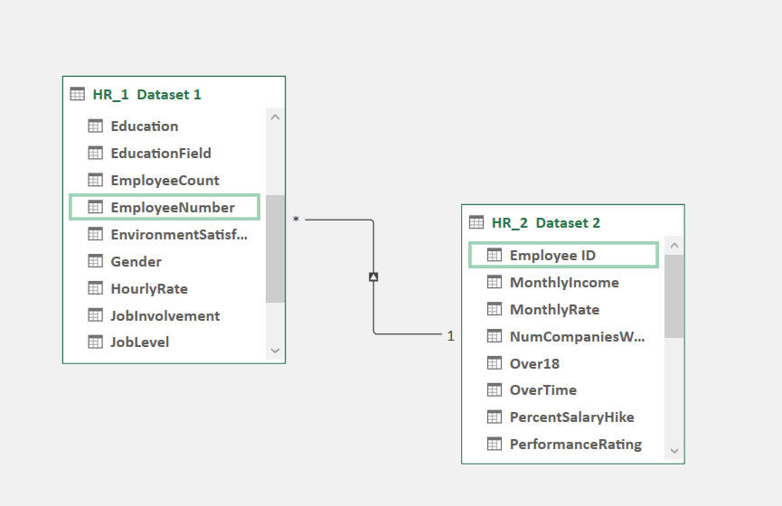

# Description

This project leverages MySQL to analyze an Employee Retention dataset. The objective is to extract valuable insights and address a set of questions regarding employee retention. By utilizing data analysis, the project aims to facilitate informed decision-making and contribute to the growth and success.

## Installation

To run this project on your machine you need to install any SQL supported DBMS then follow the steps below:
- Create a database.
- Create tables using the schemas.
- Import csv files provided in the dataset folder.

Note: If you are using PostgreSQL then restore the backup file of the database and save yourself some time.
## Datasets
- Dataset Name: HR_1 & HR_2
- Dataset Type: Excel Data
- Dataset Size: 50k records each

## Database and Tools
MySQL Workbench
## Entity Relationship Diagram

## Business Objective
- This analysis focuses on identifying the factors contributing to employee attrition. 
- It involves studying various tools to analyze trends and patterns related to employee resignations. 
- The objective is to gather valuable insights to inform future employee retention strategies.
## Questions
The following are few of the questions that are answered in this project.
- Average Attrition rate for all Departments.
- Average Hourly rate of Male Research Scientist.
- Attrition rate Vs Monthly income stats.
- Average working years for each Department.
- Job Role Vs Work life balance.
- Attrition rate Vs Year since last promotion relation.

## Results
### **`Average Attrition rate for all Departments.`**

- The average attrition rate for all departments is 51.21%, comprising 12,545 males and 12,560 females. 
- The highest attrition rate is observed in the Research and Development department (16.97% attrition-wise, 51.21% department-wise), while the lowest attrition rate is found in the hardware department (16.09% attrition-wise, 49.44% department-wise)
- Factors contributing to the increased attrition rate include department, job role, work-life balance, and marital status. 
- In the Research and Development department, the attrition rate is higher among female employees (51.1%) compared to male employees (48.9%). Employees in different job roles within the Research and Development department experience an overall average work-life balance, which may contribute to divorce rates (highest among Sales Representatives).

### **`Average Hourly rate of Male Research Scientist.`**

- The average hourly rate for males is $114.45, which is lower than the average hourly rate for females at $115.93 in similar roles. 
- Career longevity is a crucial factor influencing the hourly rate, with females having, on average, spent more time with the organization and therefore being rewarded with a higher rate. Additionally, the female employees tend to have a noticeably higher number of years since their last promotion, which further contributes to the analysis of why males have a lower average hourly rate. 
- Family responsibilities may also play a role, as the analysis reveals a higher proportion of married or divorced males compared to females within the organization.

### **`Attrition rate Vs Monthly income stats.`**

- The attrition rate is higher in the 20k monthly income range. Job involvement could be a contributing factor, as employees in the 20k range tend to have higher job involvement compared to those in the 50k monthly income range. 
- Additionally, in the 20k monthly income range, a greater number of employees belong to the non-travel category, whereas in the 50k monthly income range, more employees frequently travel. This disparity in networking opportunities could explain why the attrition rate is higher in the 20k range.

### **`Average working years for each Department.`**

- The Software Department has a higher average working year due to their high work pressure and deadlines, whereas the Research and Development department has a lower average working year. 
- The HR and R&D departments receive the highest salary hikes due to the innovative nature of their work. 
- Sales departments tend to have the highest working hours and daily working rates, as they serve as the outlet of any business.
- In the medical field, females contribute more than males due to their superior working capabilities and talent.

### **`Job Role Vs Work life balance.`**

- Employees rate their work-life balance as follows: 25.4% find it satisfactory, 24.8% find it poor, 25.1% find it good, and 24.7% find it excellent.
- Based on the analysis, the job roles of Sales Representatives and Research Scientists tend to have high levels of job satisfaction, while Laboratory Technicians have a lower satisfaction level.
- To reduce the attrition rate, providing employees with a good work-life balance and additional benefits can be effective strategies to encourage them to stay in their jobs.

### **`Attrition rate Vs Year since last promotion relation.`**

- Based on the available data, it can be observed that a large proportion of employees have departed from the company within a three-year timeframe.
- A significant percentage of employees who left the company had relatively shorter tenures during their employment.
- Nearly half of the employees who left the organization did so while under the supervision of their current manager. However, appropriate measures can be taken to address this issue.
- To obtain more comprehensive insights, additional factors such as marital status and commuting distance can be considered.
## Conclusion

Based on the analysis of the given dataset, the major hypothetical factors influencing the attrition rate are as follows:

- **Remuneration and Promotion:** There is an inverse correlation between remuneration, promotions, and attrition. Employees who are fairly compensated are less likely to leave the organization.

- **Work Environment:** The work environment and the relationship with supervisors play a crucial role in employee retention. Implementing a policy for internal job transfers can provide employees with opportunities to work under better leaders, reducing the need to switch organizations.

- **Travel and Networking:** The analysis indicates that employees value travel and networking opportunities. Offering more business travel opportunities, such as client meetings, industry conferences, and training programs, can enhance employee engagement and retention.

- **Onboarding and Induction:** Strengthening the employee onboarding process is essential as employees tend to be more vulnerable during the initial years as they settle in and adapt to the organization. A robust onboarding program can help retain employees during this critical period.

- **Other Personal Factors:** Personal factors like age, proximity to home, and marital status can also be leveraged when developing a hiring strategy for the organization.

By considering these factors and taking appropriate measures, a company can reduce its attrition rate.
